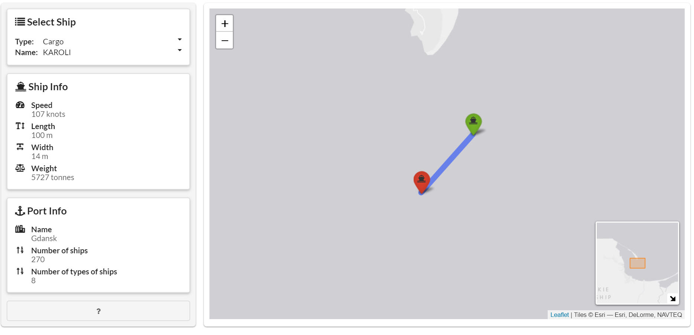

<!-- README.md is generated from README.Rmd. Please edit that file -->

```{r, include = FALSE}
knitr::opts_chunk$set(
  collapse = TRUE,
  comment = "#>",
  fig.path = "man/figures/README-",
  out.width = "100%"
)
```

# ships

<!-- badges: start -->
[](https://github.com/jakubsob/ships/actions)
[](https://ci.appveyor.com/project/jakubsob/ships)
[](https://codecov.io/gh/jakubsob/ships?branch=master)
[](https://www.tidyverse.org/lifecycle/#experimental)
[](https://choosealicense.com/)
<!-- badges: end -->

A Shiny app to find two consecutive positions reported by a ship between which it traveled longest distance.

## Installation

Install from github:

```{r, eval = FALSE}
devtools::install_github("jakubsob/ships")
```

Run:

```{r, eval = FALSE}
ships::run_app()
```

## Interface

```{r, echo = FALSE, fig.cap = "Start page of app."}

```
